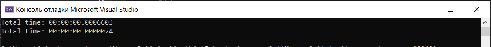

# Memory Optimization
## Original Code
```
int[,] a = new int[10,10];
            int res = 0;

            for (int i = 0; i < 10; i++)
            {
                for (int j = 0; j < 10; j++)
                {
                        a[j,i]++;
                }
            }
```
## Optimized Code
```
int[,] a = new int[10, 10];

            for (int i = 0; i < 10; i++)
            {
                for (int j = 0; j < 10; j++)
                {
                    a[i, j]++;
                }
            }
```
## Changes
- Remove unused variable `res`
- Correct `a` access by swapping `i` and `j`
## Result of Optimization

